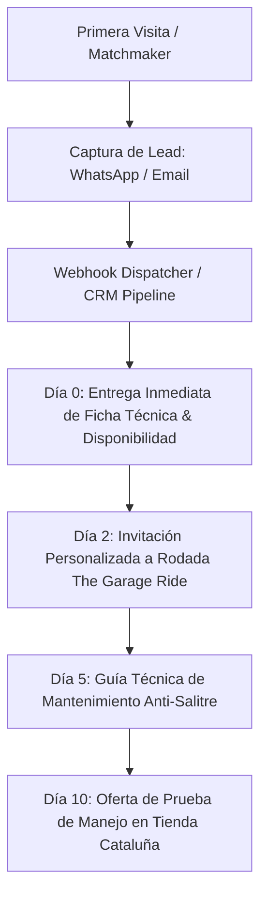

# CRO Lead Capture & Automated Recontact Engine

## Overview
This skill provides the architectural guidelines, UI/UX interaction models, and data pipeline specifications for capturing high-intent leads (Emails & Phone/WhatsApp) on boutique, luxury, and high-ticket platforms without resorting to generic, spammy popups.

---

## 1. The 3 Golden Rules of Luxury Lead Capture

1. **Exchange of Concrete Technical Value (Never Generic Discounts):**
   * *Anti-Pattern:* "Suscríbete y obtén 10% de descuento." (Degrades luxury brand perception).
   * *Best Practice:* "Recibe tu Ficha de Geometría Biomecánica & Disponibilidad en Tienda por WhatsApp." / "Acceso VIP a Drops de Cuadros Basso Bikes Italia."

2. **Context-Triggered Capture Points:**
   * **Post-Quiz/Matchmaker:** Capture at peak engagement after user answers questions (highest intent).
   * **First-Visit Intent Tracking:** Record `first_visit_at`, `category_intent` (MTB, Road, Gravel), and `viewport_device` in `localStorage`.
   * **Maintenance Service Concierge:** Capture contact when reading technical guides to schedule automatic preventive maintenance reminders.

3. **Multi-Channel Delivery with Attribution:**
   * Every lead payload must capture:
     - `lead_id` (UUIDv4)
     - `timestamp_first_visit`
     - `timestamp_capture`
     - `contact_type` (WhatsApp / Email)
     - `contact_value`
     - `interest_category` (MTB / Ruta / Gravel / Taller)
     - `matched_model` (e.g., Merida Scultura 300, Basso Tera)
     - `utm_source`, `utm_medium`, `utm_campaign`

---

## 2. Automated Recontact Funnel Sequence



---

## 3. Data Schema & Webhook Specification

```json
{
  "$schema": "http://json-schema.org/draft-07/schema#",
  "title": "LuxuryLeadPayload",
  "type": "object",
  "properties": {
    "contact": { "type": "string", "description": "Email or Phone with country code" },
    "channel": { "type": "string", "enum": ["whatsapp", "email"] },
    "first_visit": { "type": "string", "format": "date-time" },
    "category": { "type": "string" },
    "model_interest": { "type": "string" },
    "user_size": { "type": "string" },
    "source_page": { "type": "string" }
  },
  "required": ["contact", "channel", "category"]
}
```

---

## 4. UI Implementation Standard
* Built with **Dark Onyx Glassmorphism** (`rgba(18, 18, 22, 0.9)`, `backdrop-filter: blur(20px)`).
* Hairline border with subtle glow on focus (`#E11D48`).
* Instant inline confirmation without jarring page refreshes.
