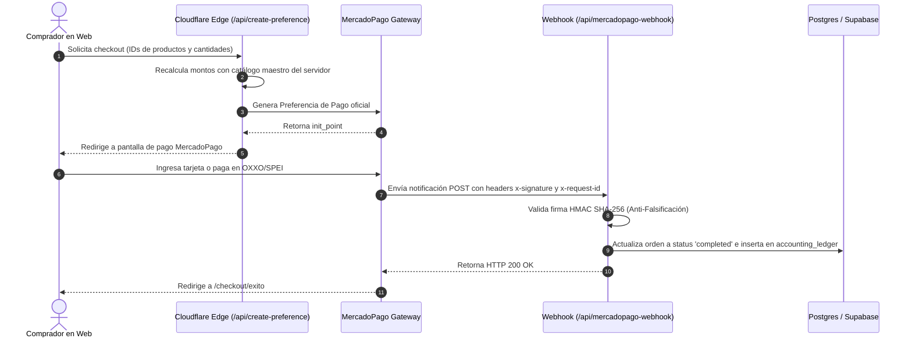

# Manual de Pasarela de Pagos (MercadoPago) — The Garage & BiciSaaS

Esta guía describe cómo opera la integración de pagos, cómo probarla localmente sin dominio público mediante túneles, y el protocolo paso a paso para pasar de Sandbox a Producción.

---

## 1. Arquitectura del Flujo de Pago y Seguridad



---

## 2. Pruebas Locales sin Dominio Público (Túneles)

MercadoPago exige que la URL receptora de Webhooks sea un endpoint público accesible por HTTPS. Dado que estás desarrollando en `localhost`, debes utilizar un túnel seguro.

### Opción A: Cloudflare Tunnel (`cloudflared`) — Recomendada
*100% gratuito, sin límites de tiempo y no requiere crear cuentas externas.*

1. **Levantar tu servidor de desarrollo con Wrangler / Cloudflare Functions**:
   ```bash
   # En la terminal 1 (corriendo Functions y Frontend):
   npm run build
   npx wrangler pages dev dist --port 8788
   ```
2. **Abrir el túnel en una segunda terminal**:
   ```bash
   # En la terminal 2:
   npx cloudflared tunnel --url http://localhost:8788
   ```
   *La consola mostrará una URL similar a:*  
   `https://random-subdomain.trycloudflare.com`

3. **Tu endpoint temporal de Webhook será**:
   `https://random-subdomain.trycloudflare.com/api/mercadopago-webhook`

---

### Opción B: Ngrok
1. **Ejecutar ngrok apuntando al puerto local**:
   ```bash
   npx ngrok http 8788
   ```
2. **Copiar la URL HTTPS generada**, por ejemplo:
   `https://abc1-201-140-50-2.ngrok-free.app/api/mercadopago-webhook`

---

## 3. Configuración en el Panel de MercadoPago Developers

### Paso 1: Configurar Webhook en Modo Prueba (Sandbox)
1. Inicia sesión en: [MercadoPago Developers](https://www.mercadopago.com.mx/developers/panel/app).
2. Selecciona tu aplicación (ej. *The Garage*).
3. En el menú lateral izquierdo, ve a **Notificaciones de Webhooks**.
4. En **Modo Prueba**:
   - **URL de producción / prueba**: Pega tu URL del túnel (ej. `https://tu-tunel.trycloudflare.com/api/mercadopago-webhook`).
   - **Eventos**: Marca las casillas:
     - `Pagos (payments)`
     - `Órdenes comerciales (merchant_orders)`
5. En la sección **Firma secreta**:
   - Copia la clave secreta de webhook y configúrala como variable de entorno local:
     `MP_WEBHOOK_SECRET="tu_clave_secreta_de_firma"`
6. Haz clic en **Probar URL**: MercadoPago enviará un ping con una firma real a tu máquina local. Tu terminal mostrará `[WEBHOOK APROBADO] 200 OK`.

---

## 4. Tarjetas de Prueba para Sandbox (México)

Para simular cobros exitosos y fallidos en Sandbox sin dinero real:

| Escenario | Número de Tarjeta | Fecha Exp | CVV | Nombre Titular |
| :--- | :--- | :---: | :---: | :--- |
| **Pago Aprobado** | `4242 4242 4242 4242` | `11/28` | `123` | APRO |
| **Fondos Insuficientes** | `4023 2222 2222 2221` | `11/28` | `123` | CALL |
| **Tarjeta Rechazada** | `4060 6222 2222 2229` | `11/28` | `123` | FUND |

---

## 5. Protocolo de Transición: De Sandbox a Producción

> [!IMPORTANT]
> **¿En qué momento exacto se cambian las credenciales a Producción?**
> Se cambian **ÚNICAMENTE** cuando se cumplan las siguientes 4 condiciones previas:
> 1. El dominio final (`https://thegarage.mx` o `https://the-garage-dw4.pages.dev`) esté activo y con certificado SSL (HTTPS).
> 2. Hayas completado la solicitud de homologación de cuenta comercial en MercadoPago (RFC de persona física/moral y CLABE interbancaria para depósitos).
> 3. La base de datos Postgres en Supabase esté en producción con sus políticas RLS activas.
> 4. El endpoint `/api/mercadopago-webhook` esté recibiendo notificaciones sin errores.

### Paso a Paso para el Go-Live:

1. **Obtener Credenciales de Producción**:
   - En el panel de MercadoPago Developers, ve a **Credenciales de Producción**.
   - Copia el `Access Token` oficial (inicia con `APP_USR-...`).
   - Ve a **Notificaciones de Webhooks** en pestaña **Producción** y registra la URL definitiva:
     `https://the-garage-dw4.pages.dev/api/mercadopago-webhook`
   - Copia la **Firma Secreta de Producción**.

2. **Inyectar Secretos en Cloudflare Pages**:
   - Ve a: Cloudflare Dashboard -> Workers & Pages -> `the-garage-dw4` -> **Settings** -> **Environment Variables**.
   - Edita las variables y define:
     - `MP_ACCESS_TOKEN` = `APP_USR-...` (Tipo: *Secret*)
     - `MP_WEBHOOK_SECRET` = `tu_firma_secreta_produccion` (Tipo: *Secret*)
   - Guarda los cambios. El siguiente despliegue o petición en vivo tomará las credenciales de producción de inmediato.

3. **Prueba de Fuego en Vivo (Cobro Real de \$10 MXN)**:
   - Ingresa a la tienda pública.
   - Agrega un producto de bajo costo o crea un producto temporal de prueba de \$10 MXN.
   - Paga con una tarjeta bancaria física real.
   - Verifica:
     - El cobro se refleja en la app de tu banco.
     - La orden se actualiza automáticamente a `completed` en la base de datos.
     - Se crea el asiento de ingreso correspondiente en `accounting_ledger`.
   - En el panel de MercadoPago, haz clic en **Devolver dinero** sobre la transacción de \$10 MXN para reembolsar el monto a tu tarjeta.
